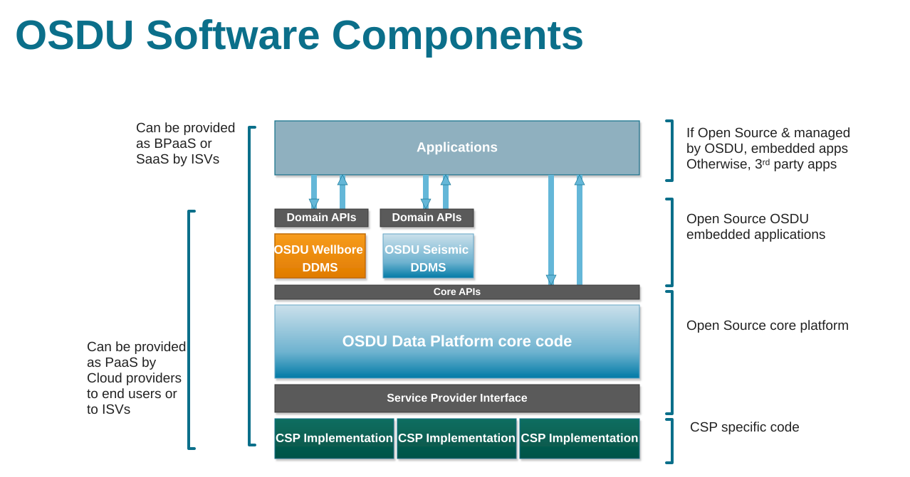
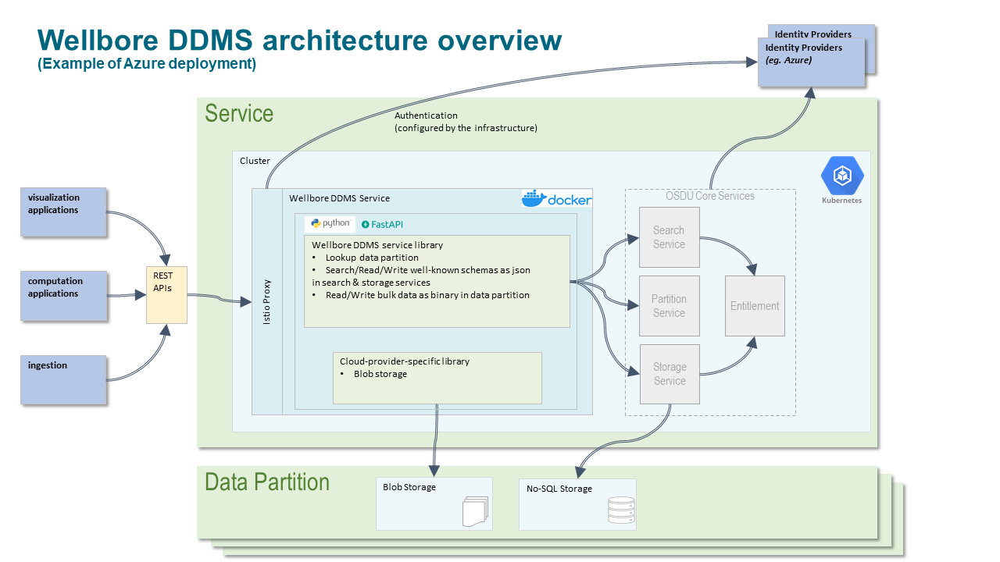
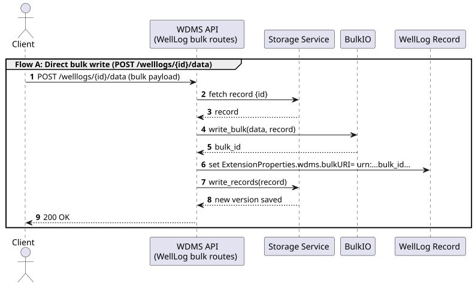
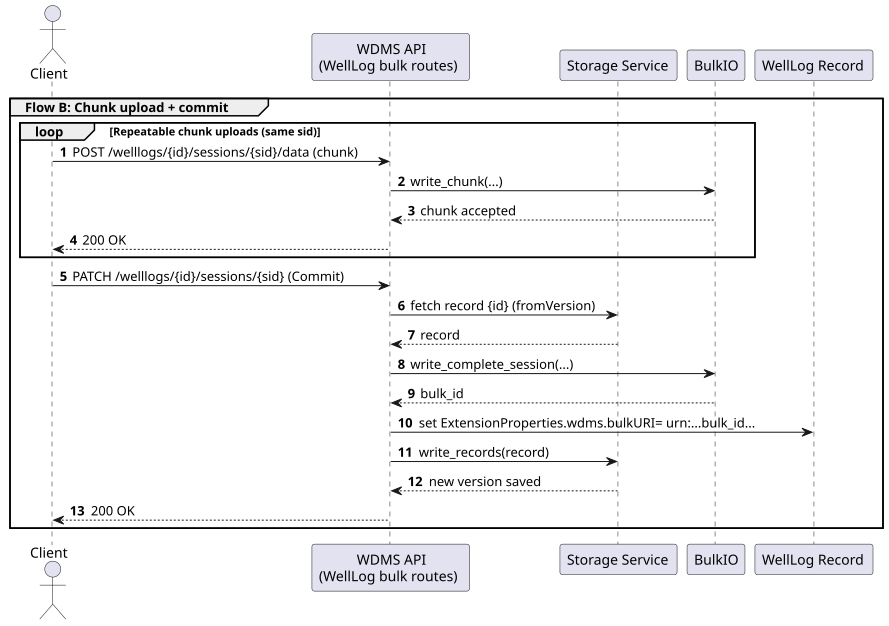
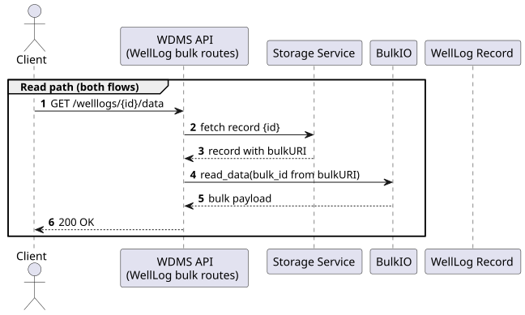

<!-- _class: lead -->
# Wellbore DDMS
### Technical Overview

---

# What this presentation covers

1. What Wellbore DDMS is solving in OSDU
2. The main APIs and supported record types
3. How WDMS and the Worker service split responsibilities
4. How bulk data, sessions, and validation work
5. How the platform stays cloud-agnostic

---

# What is Wellbore Domain Data Management Service?

A service that persists data of a specific domain and provides access through optimized domain APIs.

- Governed by the platform but developed and evolved independently
- Leverage the core services 
- Adhere to the usage patterns and common behavior
- Provide highly optimized storage & access for bulk data, with highly opinionated APIs
- Schema-based contracts aligned with OSDU Well Known Schema (WKS) entities
- Cloud portability through provider-specific storage implementations

---



---

# Position in the OSDU platform

Wellbore DDMS sits on top of core OSDU services and uses them rather than replacing them.

| OSDU capability | WDMS role                                 |
|-----------------|-------------------------------------------|
| Storage         | Record persistence and versioned metadata |
| Search          | Discovery and helper queries              |
| Schema          | WKS schema validation                     |
| Partition       | Resolve tenant/bucket information         |


> WDMS adds domain-specific APIs, bulk access, and validation rules on top of the common platform.

---

# Supported record types

| Record Type                    | Typical usage | API style |
|--------------------------------|---|---|
| Well                           | Top-level well master data | CRUD |
| Wellbore                       | Wellbore metadata | CRUD |
| WellLog                        | Log metadata + measurement arrays | CRUD + Bulk |
| WellboreTrajectory             | Directional survey data | CRUD + Bulk |
| WellboreMarkerSet              | Geology markers | CRUD |
| WellboreIntervalSet            | Interval-based wellbore interpretation data | CRUD |
| WellLogAcquisition             | Acquisition metadata for logging operations | CRUD |
| PPFGDataset                    | Pressure / fracture gradient data | CRUD + Bulk |
| WellPressureTestRawMeasurement | Pressure test measurement data | CRUD + Bulk |

Not every record type needs the same data path: some are metadata-only, others combine record storage with externalized bulk/tabular storage.

---

# API model at a glance

### Generic CRUD pattern

- `POST /ddms/v3/{recordType}` - create or update record
- `GET /ddms/v3/{recordType}/{recordId}` - read record
- `DELETE /ddms/v3/{recordType}/{recordId}` - delete record
- `GET /ddms/v3/{recordType}/{recordId}/versions` - get all record versions
- `GET /ddms/v3/{recordType}/{recordId}/versions/{version}` - get specific record version

### Bulk pattern

- `GET /ddms/v3/welllogs/{recordId}/data` - get the data according to the specified query parameters
- `POST /ddms/v3/welllogs/{recordId}/data` - writes data to the associated record, creates a new version

The CRUD shape is mostly generic; the bulk APIs are where WDMS adds most of its domain-specific value.

---



---

# The key architectural split

This is the most important implementation idea in WDMS:

### For bulk-enabled entities, record metadata and bulk data are **not stored together**

| Concern | Where it lives | Who owns the logic |
|---|---|---|
| Record metadata, versions, schema identity | OSDU Storage | WDMS main service |
| Externalized tabular measurements, parquet/json chunks | Blob/object storage | WDMS worker service |
| Link between record and externalized bulk | `ExtensionProperties.wdms.bulkURI` | WDMS main service |

### Practical implication

- For record types such as WellLog, Trajectory, PPFGDataset, and WellPressureTestRawMeasurement, large tabular measurements are handled as a **separate storage asset**
- The worker is the **bulk execution engine** for read/write/filter/merge/statistics on that externalized bulk
- Other schemas can still keep smaller, naturally structured data inline in the record JSON

### Important nuance

- Not every array or nested structure in a schema is "bulk data"
- Example: a `WellboreMarkerSet` can legitimately store its `Markers[]` inline in the record JSON
- Bulk separation is relevant for the record types that expose dedicated `/data` and session-based APIs
- WDMS also appends the bulk link into `data.DDMSDatasets`. This makes the bulkURI indexed and searchable.

---

# WDMS main service responsibilities

The main service is the **domain API layer**.

### In the source code

- `app/wdms_app.py` - app wiring and router registration
- `app/routers/ddms_v3/` - record CRUD routers
- `app/routers/bulk/` - bulk access endpoints
- `app/routers/sessions.py` - data session lifecycle
- `app/consistency/` - record-specific validation rules
- `app/injector/` - cloud-provider dependency injection

### Main responsibilities

- Validate record IDs and record kinds
- Validation against Well Known Schemas (JsonSchema)
- Enforce record-level and record/bulk consistency rules
- Persist metadata through OSDU Storage
- Maintain the metadata-to-bulk link through `bulkURI`
- Delegate bulk-heavy operations to blob storage / worker-backed flows

---

# WDMS worker responsibilities

The worker is a separate FastAPI service focused on **bulk data execution and storage-facing I/O**.

### In the source code

- `src/wdmsworker/app.py` - worker app entry point
- `src/wdmsworker/bulk/read_router.py` - read APIs
- `src/wdmsworker/bulk/write_router.py` - write + commit APIs
- `src/wdmsworker/bulk/reader.py` / `writer.py` - read/write pipeline
- `src/wdmsworker/bulk/conflict.py` - merge/conflict resolution
- `src/wdmsworker/statistics/` - bulk statistics APIs

### Why split it out?

- In-process Dask was too expensive and unstable for production
  - Inconsistent CPU and memory usage made autoscaling difficult
  - Poor performance under high request load
- The worker service isolates bulk-data work in a dedicated service, while WDMS stays focused on the API layer

---

# Write flow end-to-end

```
1. Client posts record and/or bulk payload
2. WDMS validates schema + record rules
3. WDMS writes metadata via OSDU Storage
4. If the record type uses externalized bulk, that tabular content is written
   separately to blob storage, typically through the worker service
5. WDMS stores the generated bulkURI link
6. New record version becomes current
```

### Important behaviors

- Bulk writes create new versions
- Chunked writes use sessions before commit
- Consistency checks protect record/bulk alignment
- For bulk-enabled entities, record metadata and bulk content evolve together, but are stored separately

---

# Read flow end-to-end

```
1. Client requests metadata or bulk data
2. WDMS resolves the record from OSDU Storage
3. For bulk-enabled entities, `bulkURI` points to the associated external bulk content
4. WDMS resolves bulk through a separate blob-storage path,
   with the worker handling bulk-intensive execution where applicable
5. Optional filters are applied
6. Response returns JSON or Parquet
```

### Read options

- Full bulk retrieval
- Column selection (`curves`)
- Row paging (`offset`, `limit`)
- Metadata-only read (`describe=true`)
- Statistics via worker endpoints. (Per-curve statistics: `mean, std, min, 10%, 50%, 90%, max, totalCount, and nonAbsentValuesCount`)

---

# Bulk data model

### Supported formats

| Format | Best for | Notes |
|---|---|---|
| JSON | Simpler integration and debugging | Uses Pandas-friendly structure |
| Parquet | Production-scale reads and analytics | Smaller payloads and faster processing |

### Common concepts

- For bulk-enabled entities, bulk content is tabular
- Curves can be scalar or array-backed columns
- `NaN` is the supported "no value" representation
- Externalized bulk data is stored outside the record itself
- The record links to that externalized bulk through `ExtensionProperties.wdms.bulkURI`
- Some entities instead keep their full business payload inline in record JSON

---

# Sessions

- Sessions let clients ingest data in chunks and commit or abandon once ingestion is complete. 
- When the bulk data exceeds either 10 million total values or 3 thousand columns then chunking is required.
- One should keep all values for a given curve in the same chunk and pack each chunk with as many columns as possible without crossing those limits.

### Main service side

- `app/routers/sessions.py`
- Tracks session creation, TTL, mode, and commit/abandon state

### Worker side

- `POST /data/{record_id}/session/{session_id}` - upload chunk(s)
- `PATCH /data/{record_id}/session/{session_id}` - complete session

---

## Bulk URI — direct write



---

## Bulk URI — session-based write



---

## Bulk URI — read flow



---
# Validation and consistency

This is one of the most important WDMS differentiators.

### Examples of enforced rules

| Record type | Example checks |
|-------------|---|
| WellLog     | CurveID uniqueness, ReferenceCurveID existence, column matching, monotonic reference |
| Trajectory  | Property name uniqueness, bulk column matching, MD monotonicity |
| BulkURI     | Prevents clients from breaking the record-to-bulk link |

### Where it lives in code

- `app/consistency/welllog_consistency.py`
- `app/consistency/trajectory_consistency.py`
- `app/bulk_persistence/consistency_checks.py`

---

## API Simplification: Generic Routing

Adding a new record type no longer requires a new router file.

**Generic CRUD router** (`generic_ddms_v3.py`) is configured via a small `APIConfiguration` object — specifying the URL prefix, record type, ID constraint, and consistency check. Registering a new record type is a single list entry in `wdms_app.py`.

**Generic bulk router** (`bulk_routes.py`) is shared across all bulk-enabled record types. The same router is mounted with record-type-specific dependencies, providing session, chunk, and data endpoints uniformly.

| Record type | CRUD router | Bulk |
|---|---|---|
| Well, Wellbore, MarkerSet, IntervalSet, WellLogAcquisition | type-specific | inline JSON only |
| WellLog, Trajectory | type-specific | shared bulk router |
| PPFGDataset, WellPressureTestRawMeasurement | **generic router** | shared bulk router |

> The generic pattern is the target for new record types — PPFGDataset and WellPressureTestRawMeasurement were the first to adopt it, removing **670+ lines** of duplicated code.
---

# Multi-cloud architecture

Both WDMS and the worker use a provider pattern.

### Main service

- `app/injector/main_injector.py`
- Selects Azure, AWS, GCP, IBM, or baremetal implementations

### Worker service

- `src/wdmsworker/provider/__init__.py`
- Initializes provider-specific blob storage and tenant resolution

### Result

- Domain logic stays mostly cloud-agnostic
- CSP-specific code is isolated near storage and environment integration

---


<!-- _class: lead -->
# Summary

### Wellbore DDMS combines

- **OSDU-aligned metadata APIs**
- **Domain-specific validation and consistency**
- **High-performance bulk access**
- **A dedicated worker for heavy bulk processing**
- **Cloud-agnostic deployment patterns**

It is best understood as a layered platform: OSDU core services at the base, WDMS as the domain API layer, and the worker as the bulk execution layer.

---

<!-- _class: lead -->
# Resources

- [OpenAPI specifications](https://community.opengroup.org/osdu/platform/domain-data-mgmt-services/wellbore/wellbore-domain-services/-/blob/master/spec/generated/openapi.json?ref_type=heads)
- [Documentation and diagrams](https://community.opengroup.org/osdu/platform/domain-data-mgmt-services/wellbore/wellbore-domain-services/-/tree/master/docs?ref_type=heads)
- [WDMS wiki pages](https://community.opengroup.org/osdu/platform/domain-data-mgmt-services/wellbore/wellbore-domain-services/-/wikis/home)
- [WDMS Worker Service](https://community.opengroup.org/osdu/platform/domain-data-mgmt-services/wellbore/wellbore-domain-services-worker)
